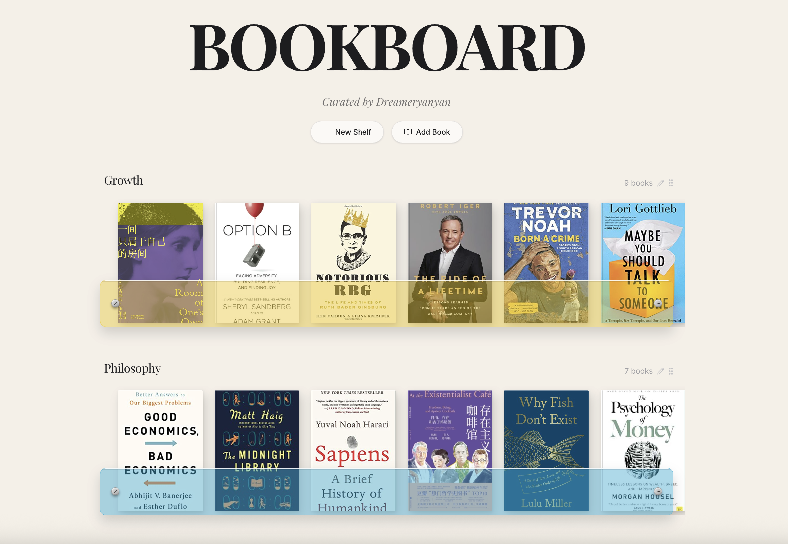
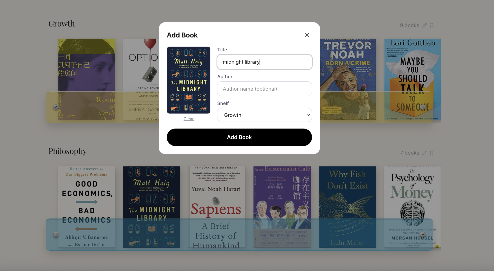

# Bookboard

A personal book tracking app curated by Dreameryanyan — featuring iOS-style horizontal scrolling shelves, colored acrylic panel overlays, and Playfair Display serif typography throughout.





## Features

- **Horizontal scrolling shelves** — organize books by category with drag-and-drop reordering
- **Auto cover fetch** — type a book title and covers are automatically fetched from Open Library
- **Acrylic color overlays** — each shelf has a customizable colored glass panel
- **Book detail view** — full descriptions, covers, and metadata for each book
- **Add / edit / delete** — full CRUD for both shelves and books
- **PostgreSQL persistence** — all data stored in a database

## Tech Stack

- **Frontend**: React, TypeScript, Tailwind CSS, Wouter, TanStack Query
- **Backend**: Node.js, Express, Drizzle ORM
- **Database**: PostgreSQL
- **Fonts**: Playfair Display (Google Fonts)

## Getting Started

```bash
npm install
npm run dev
```

The app runs on `http://localhost:5000`.

## License

MIT
